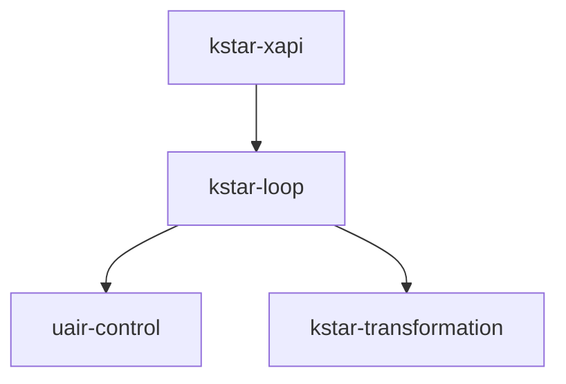

# Skill Dependency Analyzer

Analyze agent skill ecosystems to map dependencies, identify gaps, and generate integration reports.

## Core Functions

1. **Dependency Mapping** — Extract uses/used-by relationships from skill definitions
2. **Gap Detection** — Identify referenced but missing skills
3. **Integration Audit** — Verify cross-references are valid
4. **Capability Discovery** — Enumerate available skills for agent planning

## Workflow

### Step 1: Scan Skill Directory

Default paths:
- `/mnt/skills/user` — User-created skills
- `/mnt/skills/public` — Anthropic public skills
- `/mnt/skills/examples` — Example skills

```python
from analyze_dependencies import SkillDependencyAnalyzer

analyzer = SkillDependencyAnalyzer("/mnt/skills/user")
result = analyzer.analyze()
```

Or via CLI:
```bash
python scripts/analyze_dependencies.py /mnt/skills/user --format markdown
```

### Step 2: Extract Dependencies

For each skill, extract:
- **Explicit dependencies**: Skills mentioned in description or body
- **Integration points**: Functions/classes imported or referenced
- **Resource dependencies**: External tools, APIs, schemas

### Step 3: Build Dependency Graph

```
{
  "nodes": [
    {"id": "kstar-loop", "category": "core", "size": "56K"},
    {"id": "uair-control", "category": "core", "size": "42K"}
  ],
  "edges": [
    {"from": "kstar-loop", "to": "uair-control", "type": "uses"},
    {"from": "kstar-xapi", "to": "kstar-loop", "type": "uses"}
  ]
}
```

### Step 4: Generate Report

Output formats:
- **Markdown** — Human-readable report with tables
- **JSON** — Machine-readable for further processing
- **Mermaid** — Visual dependency diagram

## Standalone Usage

### Full Audit

```python
analyzer = SkillDependencyAnalyzer("/mnt/skills/user")
report = analyzer.full_audit()
# Returns: inventory, dependencies, gaps, recommendations
```

### Check Specific Skill

```python
deps = analyzer.get_dependencies("kstar-loop")
# Returns: {"uses": [...], "used_by": [...], "missing": [...]}
```

### Generate Diagram

```python
mermaid = analyzer.to_mermaid()
# Returns: Mermaid flowchart string
```

## KSTAR Meta-Skill Usage

This skill integrates with `kstar-loop` as a **capability discovery** mechanism.

### Populating S_N.tools_available

```python
def discover_available_skills(S: dict) -> dict:
    """
    Use skill-dependency-analyzer to populate now_state.tools_available.
    """
    analyzer = SkillDependencyAnalyzer("/mnt/skills/user")
    inventory = analyzer.get_inventory()
    
    S["now_state"]["tools_available"] = [
        {
            "name": skill["name"],
            "type": "skill",
            "status": "ready",
            "capabilities": skill.get("triggers", [])
        }
        for skill in inventory
    ]
    return S
```

### KSTAR Integration Points

| KSTAR Component | Analyzer Function | Purpose |
|-----------------|-------------------|---------|
| K (Knowledge) | `get_inventory()` | Know what skills exist |
| S_N (Now) | `get_available()` | Populate tools_available |
| T (Task) | `match_skill(goal)` | Find skill for goal |
| Â (Action) | `get_dependencies(skill)` | Plan skill invocation chain |
| R (Result) | `verify_integration()` | Validate skill executed correctly |

### UAIR Integration

When UAIR needs to resolve "what tools are available":

```python
def uair_retrieve_capabilities(query: dict) -> dict:
    """
    UAIR RETRIEVE handler for capability discovery.
    """
    analyzer = SkillDependencyAnalyzer("/mnt/skills/user")
    
    if "skill" in query.get("query", ""):
        return {
            "artifact_delta": {
                "now_state": {
                    "tools_available": analyzer.get_available()
                }
            }
        }
    return {}
```

## Dependency Detection Patterns

The analyzer looks for these patterns in SKILL.md:

| Pattern | Example | Detected As |
|---------|---------|-------------|
| Skill name in description | "coordinates with uair-control" | uses |
| Import statement | `from kstar_loop import` | uses |
| Reference link | `[references/uair-integration.md]` | internal |
| Integration section | "### With kstar-transformation" | uses |
| Available_subskills | `"available_subskills": ["interview.step"]` | uses |

## Output Formats

### Markdown Report

```markdown
# Skill Dependency Report

## Inventory
| Skill | Category | Size | Dependencies |
|-------|----------|------|--------------|
| kstar-loop | core | 56K | 2 |

## Dependency Graph
[mermaid diagram]

## Gaps
- uair-control references "interview.step" (not found)

## Recommendations
1. Add interview.step skill or remove reference
```

### JSON Output

```json
{
  "inventory": [...],
  "dependencies": {
    "kstar-loop": {
      "uses": ["uair-control", "kstar-transformation"],
      "used_by": ["kstar-xapi"]
    }
  },
  "gaps": [...],
  "recommendations": [...]
}
```

### Mermaid Diagram



## Files

- `scripts/analyze_dependencies.py` — Main analyzer implementation
- `references/dependency-patterns.md` — Detection pattern reference
- `references/kstar-integration.md` — KSTAR meta-skill usage guide
